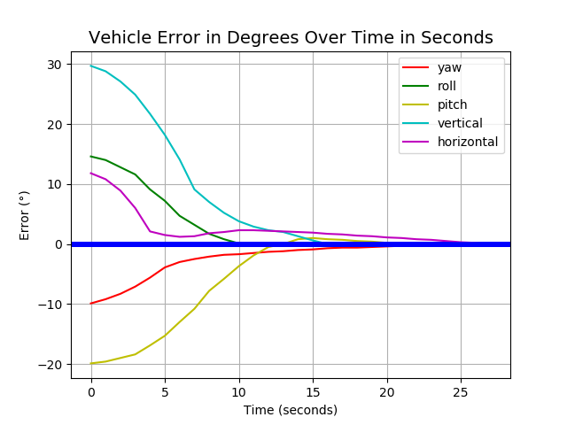

ParrotNAV 
=========
🛸 An autonomous spacecraft docking system.

## 👨‍🚀 Usage

```sh
git clone https://github.com/raad1masum/ParrotNAV.git
python main.py
```

## 💻 Demo

<p align="center">

  <br>
  <br>

</p>

## 👨‍💻 Contact

Linkedin: [Raadwan Masum](https://www.linkedin.com/in/raadwan-masum/)
<br>
Github: [raad1masum](https://github.com/raad1masum)
<br>
Devpost: [Raadwan masum](https://devpost.com/raad1masum)
