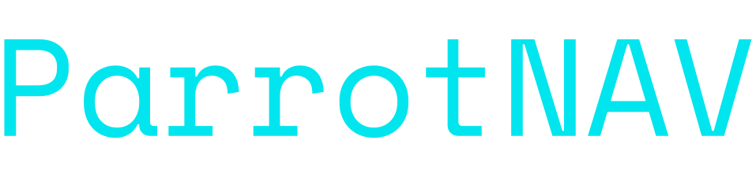

<p align="center">

</p>
<h3 align="center"><i>An autonomous spacecraft docking system.</i></h3>
<p align="center">
  
  
  
  
  
  
  
</p>

## 🚀 Usage

```sh
git clone https://github.com/raad1masum/ParrotNAV.git
python main.py
```

## 💻 Demo

<p align="center">

  <br>
  <br>

</p>

## 👨‍💻 Contact

Linkedin: [Raadwan Masum](https://www.linkedin.com/in/raadwan-masum-9147bb1a5)
<br>
Github: [raad1masum](https://github.com/raad1masum)
<br>
Devpost: [Raadwan masum](https://devpost.com/raad1masum)

## 🤝 Contributing

Contributions, PRs, issues and feature requests are welcome! Feel free to check out our [issues page](https://github.com/RGBHack/Spark/issues). 

## ❤️ Show your support

Give a ⭐️ if you liked this project!
<br>
Hope you enjoy!
